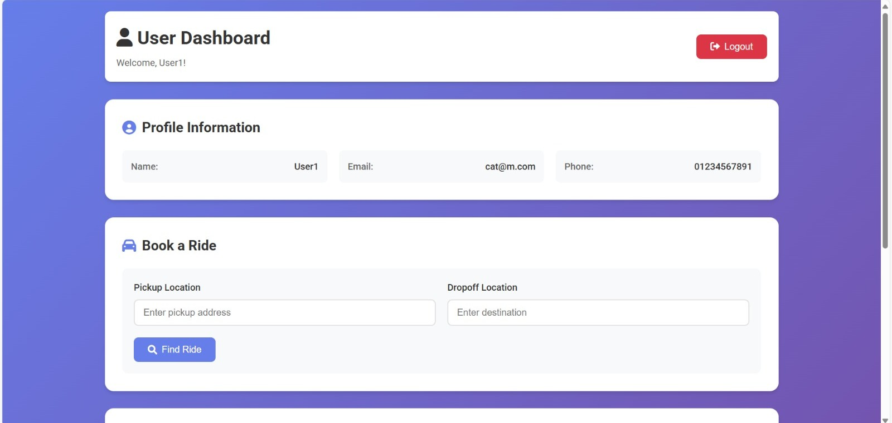
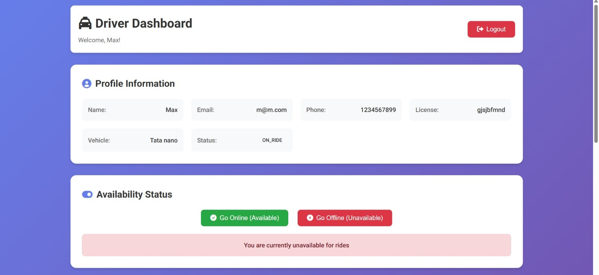
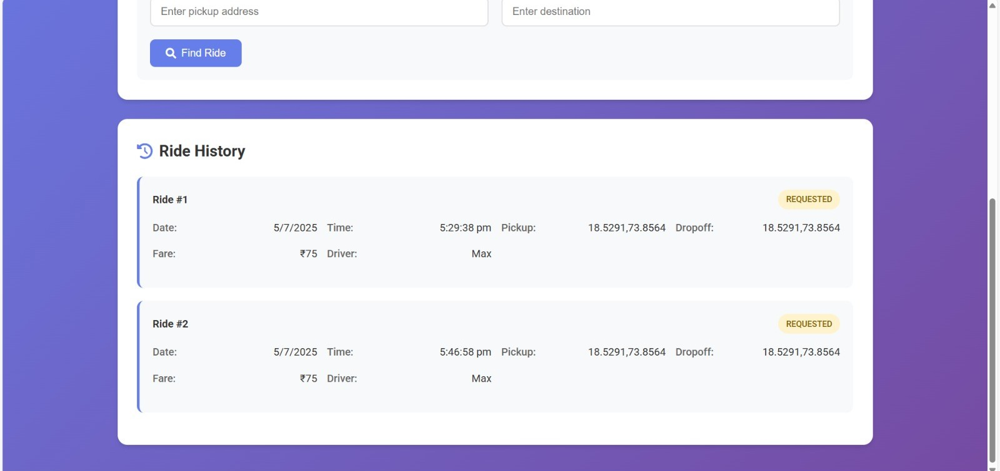

# 🚖 Cab Booking System

A full-stack web application designed to streamline ride booking services for users and drivers. This system facilitates secure authentication, real-time fare calculation, payment processing, and ride lifecycle management using modern technologies including **Spring Boot**, **MySQL**, and **vanilla JavaScript**.

---

## 📌 Overview

The **Cab Booking System** offers a complete ride-booking platform that bridges the gap between users and drivers. It supports:

- Seamless ride booking with real-time fare estimation  
- Role-based access control and secure JWT authentication  
- A responsive user interface for both users and drivers  
- Lifecycle management of rides from request to completion

---

## 🎯 Features

### ✅ User-Focused
- Account registration and login  
- Ride booking with fare estimates  
- Real-time ride status updates  
- Payment via Cash, Card, or UPI  
- Rate drivers post-ride  
- Access ride history and receipts

### ✅ Driver-Focused
- Driver registration with vehicle details  
- Availability toggle and ride request management  
- Update ride status (Accepted → In Progress → Completed)  
- View ride history and earnings summary

---

## 🖼️ Screenshots

### 👤 User Dashboard



---

### 🚗 Driver Dashboard



---

### 📑 Ride History



---

## 🧱 Tech Stack

### Frontend
- HTML5, CSS3, JavaScript (ES6+)
- Responsive layout using Flexbox and CSS Grid
- API communication using Fetch API

### Backend
- Java 21, Spring Boot 3.2.3
- Spring Security + JWT
- Spring Data JPA
- MySQL 8.x
- Maven

### External Services
- OSRM (Open Source Routing Machine)
- Postman (for API testing)

---

## 🗂️ Project Structure

```
cab-booking-system/
├── src/main/java/com/cabbooking/
│   ├── controller/
│   ├── service/
│   ├── repository/
│   ├── entity/
│   ├── security/
│   └── config/
├── src/main/resources/
│   └── application.properties
├── cab-frontend/
│   ├── index.html
│   ├── styles.css
│   └── js/
│       ├── auth.js
│       ├── api.js
│       ├── user-dashboard.js
│       └── driver-dashboard.js
```

---

## 🛠️ Backend Setup in IntelliJ

### 🔗 Backend Code Link
> [Access backend files](https://drive.google.com/drive/folders/1yG61tS2x0GLVrfIypz3GVNabNJ6hjQVG?usp=sharing)

### 💻 IntelliJ Instructions

1. **Download or clone the project**
2. **Open IntelliJ IDEA → File → Open → Select the backend folder**
3. **Ensure Maven is detected → Load Maven project if prompted**
4. **Create the database in MySQL:**
   ```sql
   CREATE DATABASE cab_booking;
   ```
5. **Configure `application.properties`**
   ```properties
   spring.datasource.url=jdbc:mysql://localhost:3306/cab_booking
   spring.datasource.username=your_username
   spring.datasource.password=your_password
   ```
6. **Run the application**
   - Navigate to `CabBookingSystemApplication.java`
   - Right-click and choose **Run**

---

## 🌐 Frontend Setup

```bash
cd cab-frontend

# Option 1: Open index.html directly in a browser
# Option 2: Run a local server
python -m http.server 8000
# or
npx http-server
```

---

## 🔐 Authentication & Authorization

- JWT-based secure login
- Role-based access (User or Driver)
- Token validation for protected routes

---

## 🧪 Testing

### Backend
- Unit & Integration Testing with JUnit
- Authentication and API endpoint validation

### Frontend
- Manual user testing
- API communication validation

---

## 🚀 Deployment

### Local Deployment

```bash
# Backend
mvn clean package
java -jar target/cab-booking-system-0.0.1-SNAPSHOT.jar

# Frontend
python -m http.server 8000
```

### Cloud Deployment

- **Backend**: Heroku, Render, or AWS EC2
- **Frontend**: Netlify, Vercel, or GitHub Pages

---

## 🧭 Roadmap

- Real-time GPS tracking
- WebSocket for live updates
- Admin analytics dashboard
- Docker containerization
- Microservices structure

---

## 📄 License

This project is open-source under the [MIT License](LICENSE).

---

## 🙌 Contact

For queries or contributions, open an [issue](https://github.com/your-username/cab-booking-system/issues) or submit a pull request.
